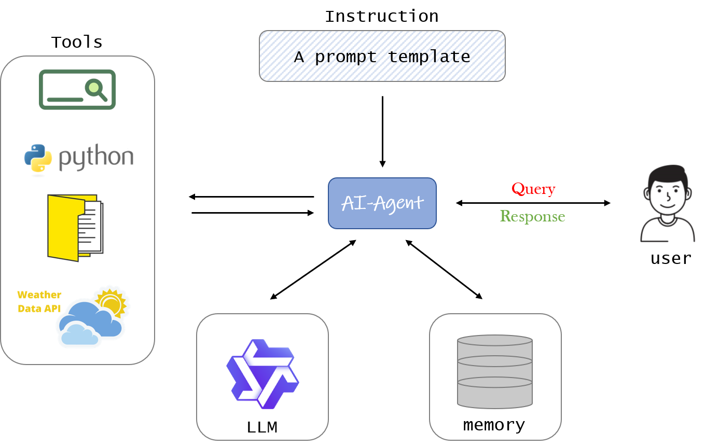

# AI-Agent

## 1.Agent原理图



## 2.Agent实现

`Tools:搜索引擎，文件的读取，写入和添加`

`LLM:qwen1.5-110b-chat`

`prompt template:`

```
prompt_template = """
    你是一个问答专家，你必须始终独立做出决策，无需寻求用户的帮助，发挥你作为大语言模型的优势，追求简单的策略，不要涉及法律问题。

目标：
{query}

限制条件说明：
{constraints}

动作说明：这是你唯一可以使用的动作，你的任何操作都必须通过以下操作实现：
{actions}

资源说明：
{resources}

最佳实践的说明：
{best_practices}

agent_scratch:{agent_scratch}

你应该只以json格式响应，响应格式如下：
{response_format_prompt}
确保响应结果可以由python json.loads()成功加载。
"""
```

使用Agent

```
python client_main.py
```

## Reference

[大模型agent](https://www.bilibili.com/video/BV1Sz421m7Rr/?spm_id_from=333.999.0.0&vd_source=c0e4d1c85e26d15b3d5fcfd86f486a34)

[Qwen-Agent](https://github.com/owenliang/agent)